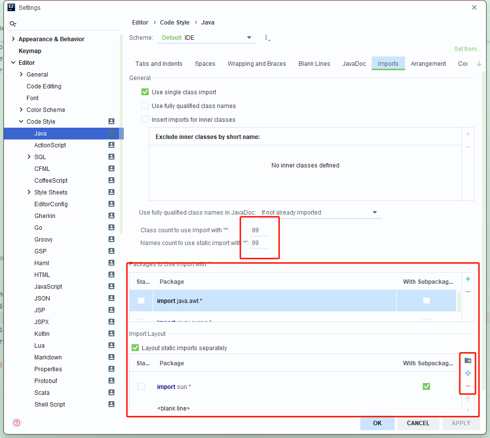

# checkstyle-githooks

通过checkstyle检测代码风格，结合githooks的钩子实现，在commit时，检测代码风格规范，让不符合规范的代码停留在本地，

在“Class count to use import with '*'”选项中，您可以设置每个包中导入的类的数量。例如，如果您将其设置为“1”，则只有在需要导入两个或更多类时，
才会使用通配符导入（即“import java.util.*;”）。

在“Import Layout”中，您可以定义导入语句的排列顺序。默认情况下，IntelliJ IDEA 使用以下顺序：

1. java.*
2. javax.*
3. kotlin.*
4. org.*
5. com.*
6. 其他包

您可以单击“Add”按钮来添加自定义包，并使用箭头按钮来移动它们的位置以满足您的需求。

最后，单击“OK”按钮来应用您的更改并重新排列导入语句。

